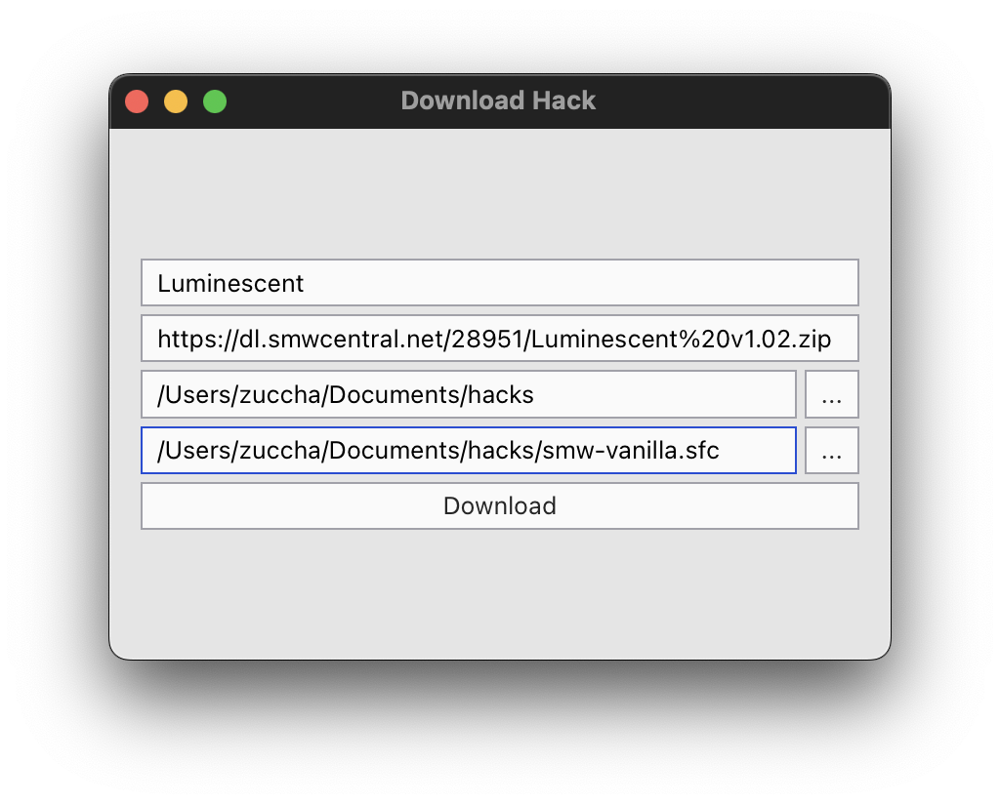
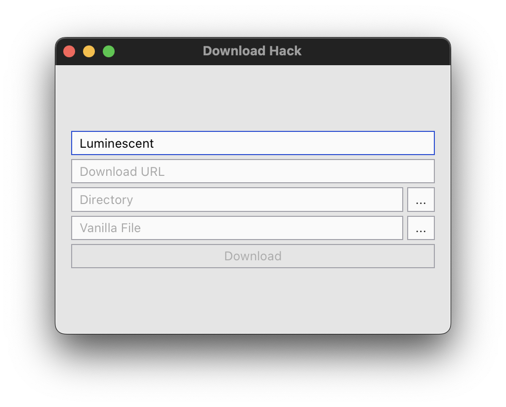
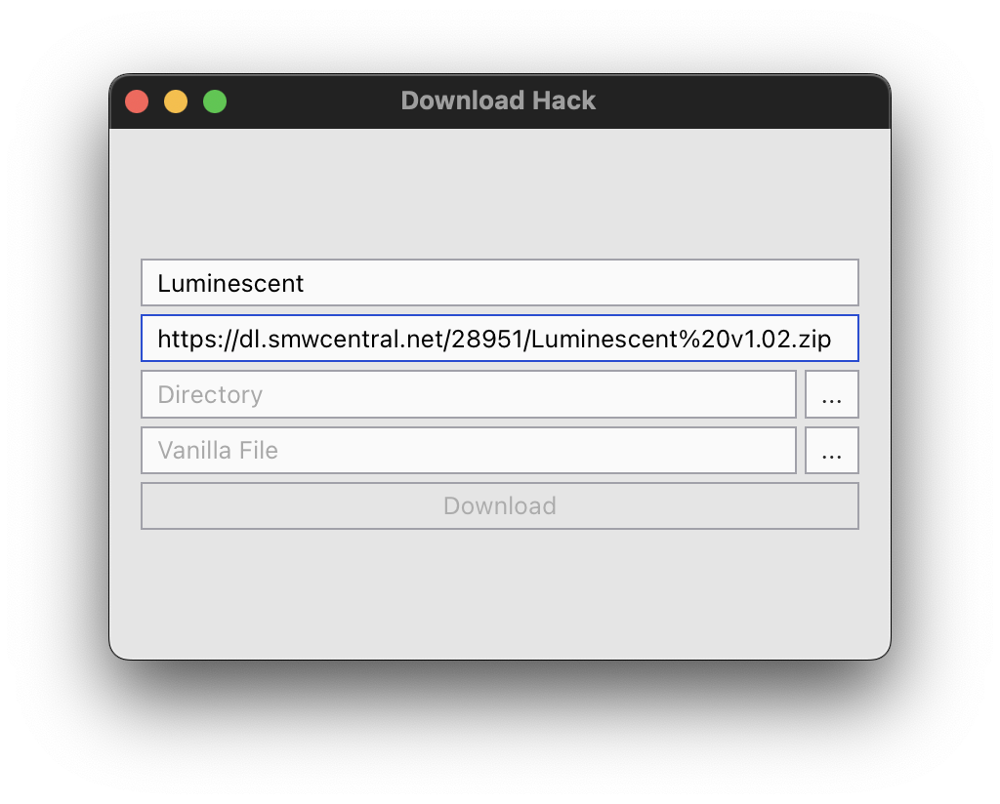
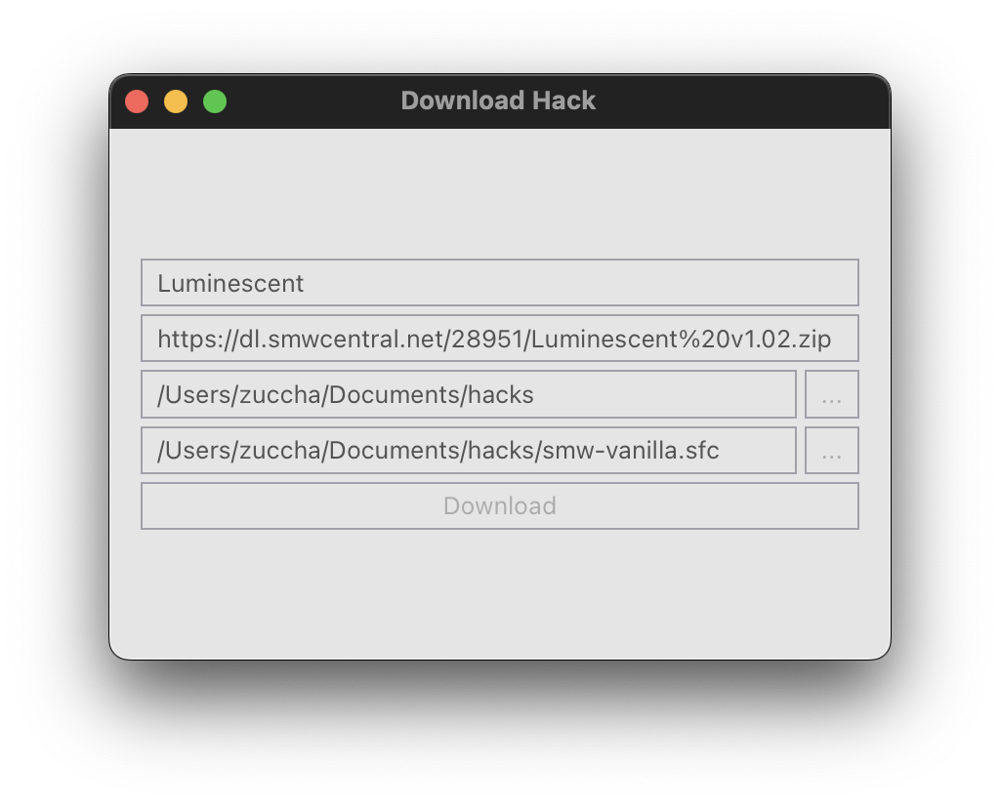

# ROM Hack Downloader

Download, unzip, and patch ROM hacks all in one go.



## Downloads

The tool is available for:
- macOS
- Windows

## Instructions

1. Choose the hack name
  
2. Copy the download URL
  
3. Paste the URL
  
4. Pick the base folder where you want the hack to be saved (in the example, the tool will create a "Luminescent" folder inside "hacks")
  
5. Select an original, untouched ROM of the game
  
6. Click "Download" and wait for the program to finish
  
  The tool will:
    1. Download, extract, and remove the zip file inside a folder name after the hack, within the chosen base folder
    2. Identify any `bps` file and patch it onto the original vanilla ROM using Flips, creating an equivalent `sfc` file
    3. Remember the base directory and vanilla ROM location for future use

## Credits

The tool has been developed by zuccha using:

- [Flips](https://github.com/Alcaro/Flips) by Alcaro, for patching on Windows
- [MultiPatch](https://projects.sappharad.com/multipatch/) by Paul Kratt, for patching on macOS
- [Tauri](https://tauri.app/), as a developing framwork

## Run Locally

If you want to run the tool locally, first you will need to:
1. [Install Node](https://nodejs.org/en)
2. [Setup Tauri](https://tauri.app/v1/guides/getting-started/prerequisites)

After that, you have to clone this repository, navigate to the tool directory, and install dependencies
```bash
git clone https://github.com/zuccha/rom-hack-downloader.git
cd rom-hack-downloader
npm install
```

Finally, you can run it
```bash
npm run tauri dev
```
