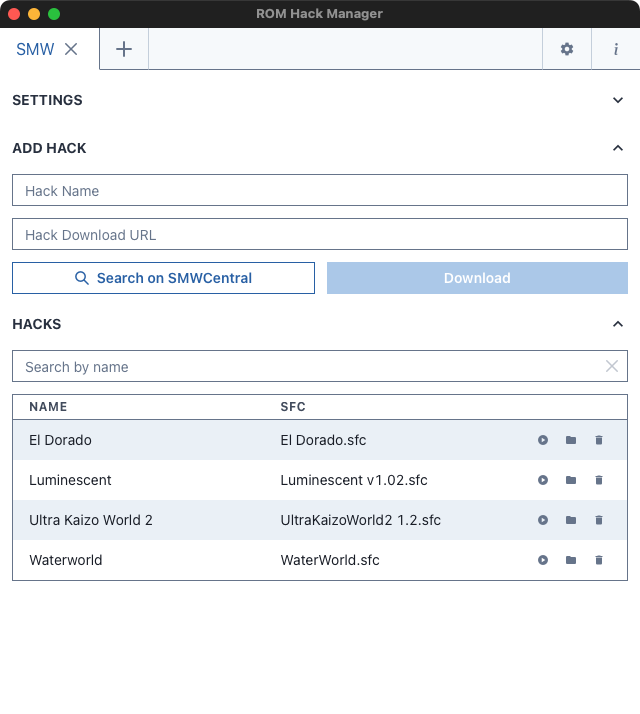
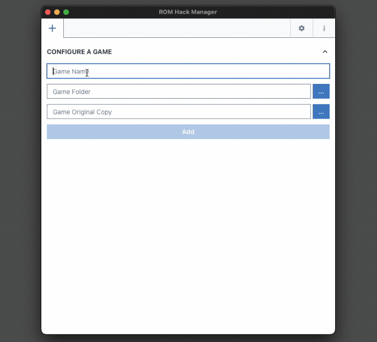
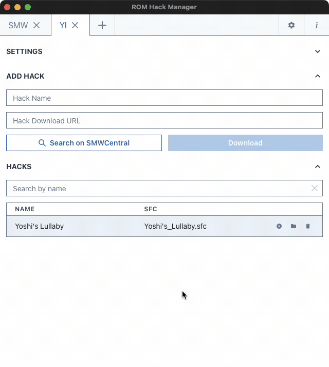
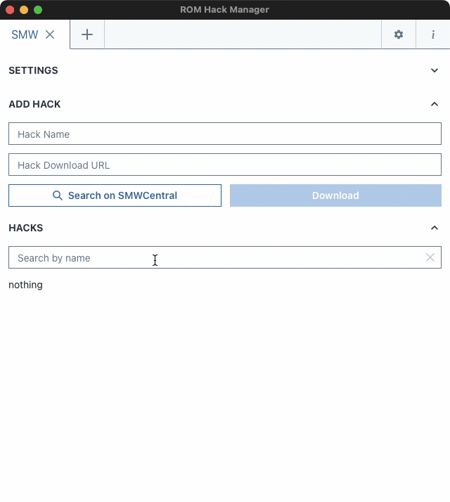
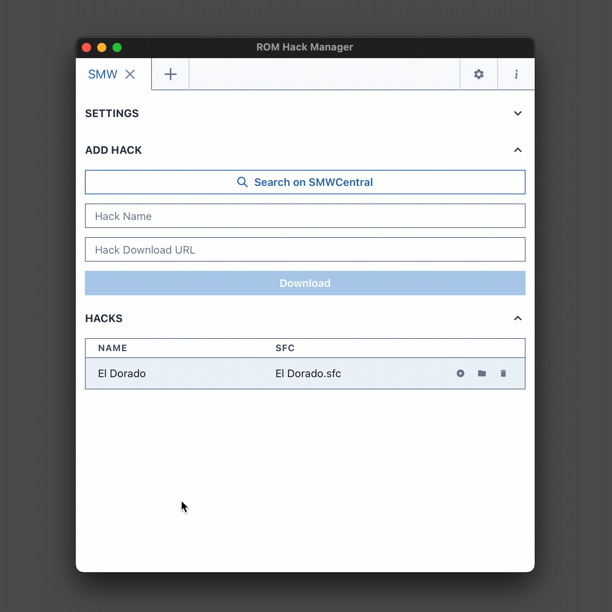
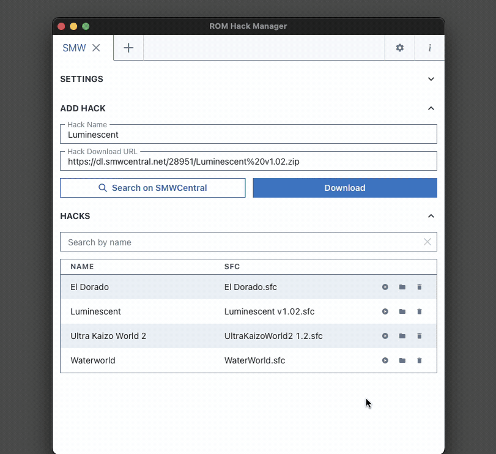

# ROM Hack Manager

Download, unzip, and patch ROM hacks all in one go. Manage hacks for your SNES
games.

|  |
| :-------------------------------------------------------------------------------------: |
|                                    ROM Hack Manager                                     |

## Downloads

| OS          | Type               | Link                          |
| ----------- | ------------------ | ----------------------------- |
| Windows[^1] | `.exe`             | [Download](https://zuccha.io) |
| Windows     | `.msi` (installer) | [Download](https://zuccha.io) |
| macOS[^2]   | `.app`             | [Download](https://zuccha.io) |

- [^1] This works only for Windows 10 or newer.
- [^2] Since I'm not a certified Apple developer, newer versions of macOS won't
  let you open the application (saying it's broken). To use it, you have to
  disable Gatekeeper for the application:
  `xattr -cr "/path/to/ROM Hack Manager.app"`
  ([instructions](https://osxdaily.com/2019/02/13/fix-app-damaged-cant-be-opened-trash-error-mac)).
  **N.B.: Do this only if you trust me :).**

## Features

With _ROM Hack Manager_ you can:

- **Manage hacks:** The tool will list SNES ROM hacks for selected games.
- **Download hacks:** Download, unzip, and patch hacks automatically. You can
  search _Super Mario World_ and _Yoshi Island_ hacks on SMWCentral's catalogue
  directly from within the tool.

## Guide

Instructions on how to use the tool and its features.

### Configure a game

Before you can download a hack, you need to configure a game. A game consists of
the following:

- _Name_: Name of the game, it can be anything (it's the name that appears in
  the tabs on top).
- _Folder_: Folder containing the hacks for the game. The tool will download
  hacks for the game inside this folder.
- _Original copy_: Original copy of the game, as a ROM. Patches downloaded with
  the tool will be applied to this file (without modifying it).

|  |
| :-----------------------------------------------------------------------------------: |
|                                   Configure a game                                    |

Configuring a game doesn't create any directory, it only operates existing ones.
You can remove a game from the tool through the tabs on top

|  |
| :-----------------------------------------------------------------------------: |
|                                  Remove a game                                  |

Removing a game this way won't remove any folder, it will just tell the tool not
to list the game.

You can change the game's name, folder, and original copy from the game tab
itself (under the _Settings_ section, collapsed by default).

### Download a hack

To download (and patch) a hack, you have to specify:

- _Name_: A name of your choosing (usually the name of the hack). This will be
  the name of the folder created by the tool inside the game folder.
- _Download URL_: URL for downloading the zip file. For example, you can find
  this URL on SMWCentral.

|  |
| :------------------------------------------------------------------------------------------: |
|                                   Download a hack manually                                   |

You can also look for a game present on SMWCentral directly from within the tool

|  |
| :---------------------------------------------------------------------------------------------------------: |
|                                  Look for a hack in SMWCentral's catalogue                                  |

You can look for _Super Mario World_ and _Yoshi Island_ hacks.

The tool will download the zip file from the given URL, extract it inside a
folder of the chosen name (`<game_folder>/<hack_name>`), and it will patch the
first `.bps` file it finds.

If the URL doesn't download a zip, or if the zip doesn't contain a `.bps` file,
the operation will fail.

After you download a hack, you'll have to wait a few seconds for it to appear in
the list underneath, while the tool is syncing with the operating system.

### Manage hacks

Once you configured a game (_i.e._, selected a folder containing that game's
hacks), the tool will list hacks present in that folder. A hack is a folder
containing a `.sfc` file.

The tool provides the following operations on hacks

- **Play:** The tool opens the `.sfc` file of the hack with its default
  application (it should be an emulator). You can specify the default app on you
  operating system. If the hack has more than one `.sfc` file, the tool will
  play the one that you see in the table (you cannot control which one).
- **Open folder:** Open the folder containing the hack.
- **Delete:** Delete the hack. This deletes the folder of the hack and all its
  contents.

|  |
| :-----------------------------------------------------------------------: |
|                                 Hack list                                 |

### Settings

The tab with the gear icon allows to modify global settings. Their names should
be pretty self-explanatory.

## Credits

_ROM Hack Manager_ has been developed by zuccha using:

- [Flips](https://github.com/Alcaro/Flips) by Alcaro, for patching on Windows
- [MultiPatch](https://projects.sappharad.com/multipatch/) by Paul Kratt, for
  patching on macOS

## License

This tool is under GPL3, which roughly means:

- You can apply modifications to the software.
- You should credit the author for the original for, and you can credit yourself
  for the modifications.
- If you modify this software, you must label it as a modification.
- Any applications containing any part of this software must provide the full
  source code needed to modify and rebuild this application, under the same
  license. Including this interpretation is optional.
- The author claims no copyright over input, output, or error messages generated
  by this tool.

This applies to this program, Flips, and MultiPatch.

[More about GP3](https://www.gnu.org/licenses/gpl-3.0.en.html)

## Compatibility

This software is compatible with macOS and Windows 10 or newer.

If you want to use it on Windows 7 or older, you'll need to download the version
with the installer.

This software is NOT compatible with Windows 32-bit.

## Run Locally

If you want to run the tool locally, first you will need to:

1. [Install Node](https://nodejs.org/en)
2. [Setup Tauri](https://tauri.app/v1/guides/getting-started/prerequisites)

After that, you have to clone this repository, navigate to the tool directory,
and install dependencies

```bash
git clone https://github.com/zuccha/rom-hack-manager.git
cd rom-hack-manager
npm install
```

Finally, you can run it

```bash
npm run tauri dev
```
