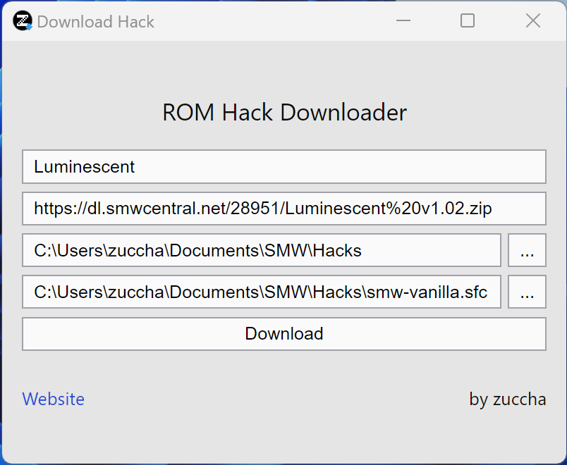
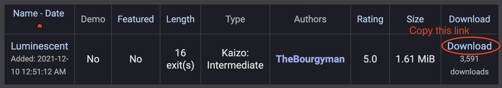
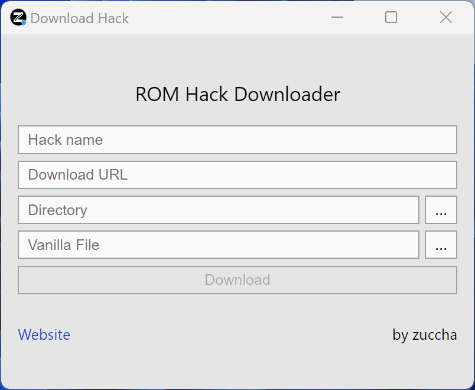
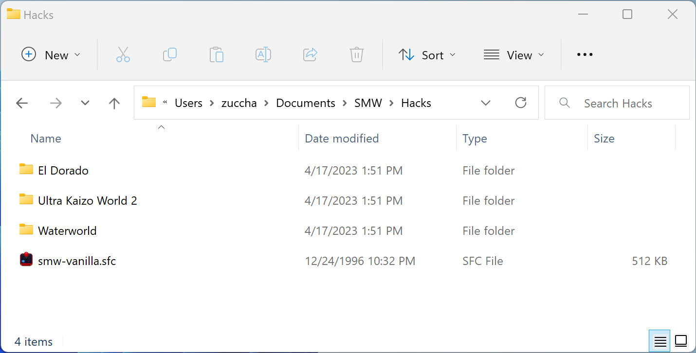
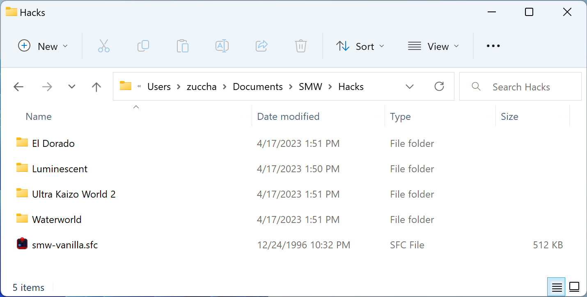

# ROM Hack Downloader

Download, unzip, and patch ROM hacks all in one go.



## Downloads

The tool is available for:
- [Windows](https://github.com/zuccha/rom-hack-downloader/releases/download/1.0.0/ROM.Hack.Downloader_1.0.0_win.zip): Package containing the executable and Flips. **N.B.: Flips needs to stay in the _resources_ folder.**
- [Windows (installer)](https://github.com/zuccha/rom-hack-downloader/releases/download/1.0.0/ROM.Hack.Downloader_1.0.0_win_installer.zip): Automatically install the application on your PC.
- [macOS](https://github.com/zuccha/rom-hack-downloader/releases/download/1.0.0/ROM.Hack.Downloader_1.0.0.macos.zip): Since I'm not a certified Apple developer, newer versions of macOS won't let you open the application (saying it's broken). To use it, you have to disable Gatekeeper for the application: `xattr -cr "/path/to/ROM Hack Downloader.app"` ([instructions](https://osxdaily.com/2019/02/13/fix-app-damaged-cant-be-opened-trash-error-mac)). **N.B.: Do this only if you trust me :).**

## Instructions

1. Copy the URL for downloading the game zip file:

    ||
    |:-:|
    |Download URL on SMW Central|

2. Fill the required fields:

    1. **Hack Name:** The hack will be downloaded in a folder with the chosen name
    2. **Download URL:** URL for downloading the hack zip (e.g., the download link found on SMW Central for each hack)
    3. **Directory:** Folder containing all your ROM hacks
    4. **Vanilla File:** An original, untouched ROM of the game

    |||
    |:-:|:-:|
    |Empty form|Filled form|

3. Press **Download**. The tool will:
    1. Download, extract, and remove the zip file inside a folder name after the hack, within the chosen base folder
    2. Identify any `bps` file and patch it onto the original vanilla ROM using Flips, creating an equivalent `sfc` file
    3. Remember the base directory and vanilla ROM location for future use

    |||
    |:-:|:-:|
    |Folder before download|Folder after download|

## Credits

The tool has been developed by zuccha using:

- [Flips](https://github.com/Alcaro/Flips) by Alcaro, for patching on Windows
- [MultiPatch](https://projects.sappharad.com/multipatch/) by Paul Kratt, for patching on macOS
- [Tauri](https://tauri.app/), development framework

## Run Locally

If you want to run the tool locally, first you will need to:
1. [Install Node](https://nodejs.org/en)
2. [Setup Tauri](https://tauri.app/v1/guides/getting-started/prerequisites)

After that, you have to clone this repository, navigate to the tool directory, and install dependencies
```bash
git clone https://github.com/zuccha/rom-hack-downloader.git
cd rom-hack-downloader
npm install
```

Finally, you can run it
```bash
npm run tauri dev
```
